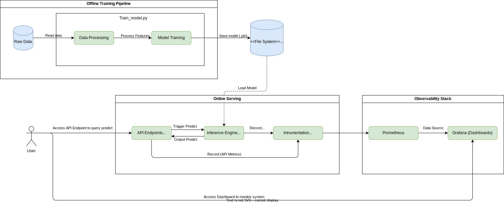
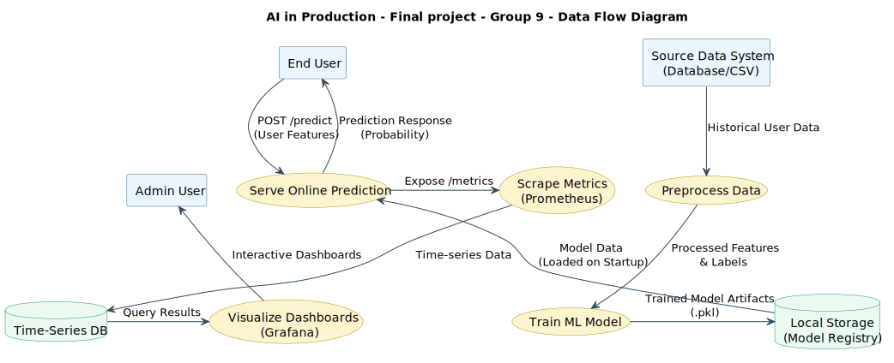
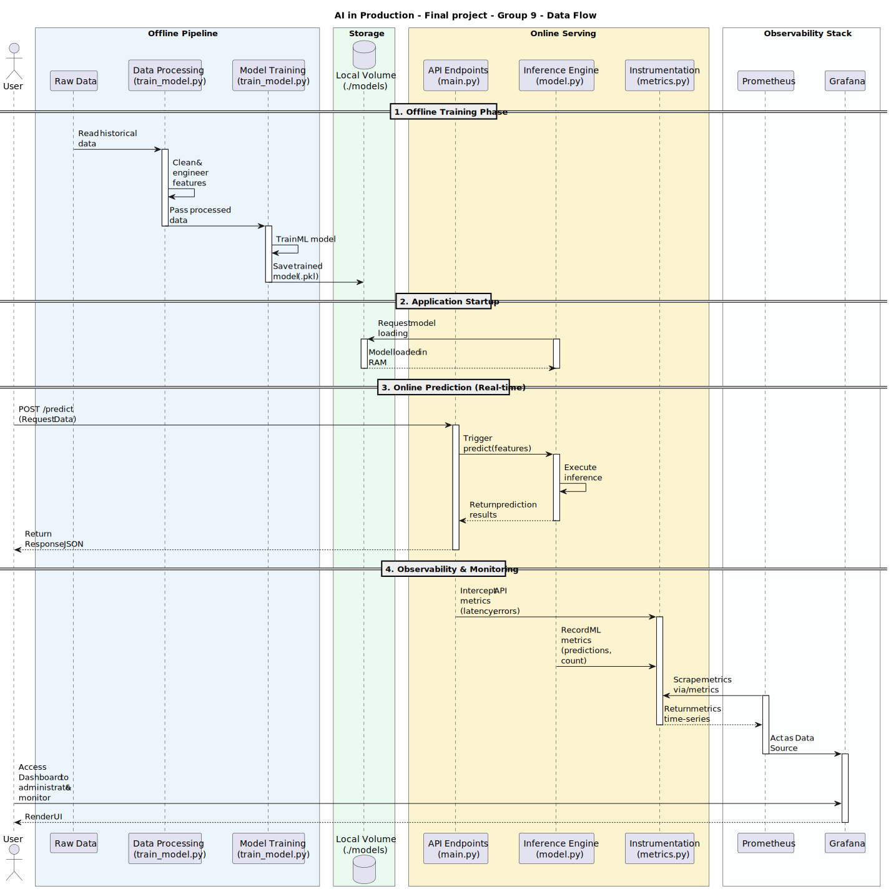

# AI in Production - Final project - Group 9

## I. System Architecture

### 1.1. System Overview

#### 1.1.1. Internal Components
The system is designed as a monolithic Machine Learning Application consisting of an offline training pipeline, a real-time online serving API, and an observability stack.

*   **Offline Training Pipeline (Local Scripts):** Reads `Raw Data`, processes features (`Data Processing`), and trains the model (`Model Training`) using `train_model.py`.
*   **Model Registry (Local Storage):** The trained model is saved as a `.pkl` file to a local volume (`./models`).
*   **Online Serving (FastAPI Container):** 
    *   **API Endpoints (`main.py`):** Exposes REST API endpoints to receive real-time prediction requests.
    *   **Inference Engine (`model.py`):** Loads the model into RAM on startup and generates predictions when triggered.
    *   **Instrumentation (`metrics.py` & middleware):** Intercepts API requests to record API metrics and captures ML metrics from the inference engine.
*   **Observability Stack (Docker Containers):** 
    *   **Prometheus:** Scrapes metrics from the FastAPI application via the `/metrics` endpoint.
    *   **Grafana:** Acts as a dashboard for metric visualization utilizing Prometheus as its data source.

#### 1.1.2. External Actors
*   **User:**
    *   Accesses the **API Endpoint** (e.g., via `POST /predict`) to query predictions.
    *   Accesses the **Grafana Dashboard** to administrate and monitor system health and metrics.
  
### 1.2. System Architecture

## II. Data Flow

### 2.1. Overview

The data flow within the system is architected around three distinct pipelines to cleanly separate model development, real-time inference, and system monitoring:

1. **Training Flow (Offline):** Extracted historical `Raw Data` undergoes preprocessing to generate training features. The Machine Learning model is trained on these features and the final model artifacts are serialized and stored securely in the `Model Registry` (Local Volume).
2. **Serving Flow (Online):** When the FastAPI container starts, it loads the serialized model from the volume directly into RAM. End Users send real-time `POST /predict` requests containing fresh features. The API routes these to the Inference Engine, which processes them and instantly returns a prediction response.
3. **Observability Flow:** During online operations, the `Instrumentation` module continuously tracks both API-level metrics (e.g., latency, HTTP errors) and ML-level metrics (e.g., prediction distributions). `Prometheus` periodically scrapes this data into its Time-Series Database, feeding it to `Grafana` where Administrative Users can monitor system health interactively.
### 2.2. Data Flow Diagram

### 2.3. Data Flow Sequence

## Tech Stack
*   **Programming Language:** Python
*   **Web Framework:** FastAPI
*   **Machine Learning:** Scikit-learn
*   **Monitoring:** Prometheus
*   **Visualization:** Grafana
*   **Containerization:** Docker
*   **CICD:** GitHub Actions
*   **Testing:** Pytest
*   **Documentation:** Markdown, PlantUML, Draw.io